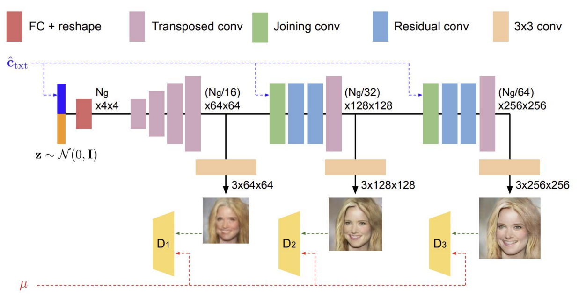

# 2023 OUTTA AI Bootcamp final project

이 프로젝트는 2023 제 2회 OUTTA AI 부트캠프 딥러닝반의 최종 팀 프로젝트를 위한 스켈레톤 코드입니다.<br>
<br>
이 프로젝트는 주어진 text prompt에 대응되는 이미지를 생성하는 task입니다.<br>
<br>
이번 프로젝트에서는 Conditional GAN 을 이용하여 간단한 T2I Generation model 을 구현해 보는 것을 목표로 합니다.<br>
<br>
이 프로젝트를 수행하기 위해서는 'network.py' 파일과 'train.py' 파일을 수정하셔야 하며, 다른 파일은 수정하지 않는 것을 추천 드립니다.<br>
<br>
이 프로젝트에 대한 자세한 가이드라인 및 평가 기준은 업로드되어 있는 '2023_final_project_guideline.pdf'를 참고하시길 바랍니다.<br>
<br>
이 프로젝트에 대한 간단한 설명 영상은 다음의 [링크](https://www.youtube.com/watch?v=ZQsFbdTFZjo)에서 볼 수 있습니다.<br>
<br>
이 프로젝트는 Google Colab 환경에서 시행되는 것을 기본으로 하여 제작되었습니다.<br>
<br>
### MM-CelebA-HQ-Dataset

데이터셋은 다음의 [링크](https://drive.google.com/drive/folders/1HwCTiyUUiN71fATB56Ea8qfUEq-X8AG7?usp=sharing)에서 다운로드 받을 수 있습니다.<br>
<br>
데이터셋의 출처는 [다음](https://github.com/IIGROUP/MM-CelebA-HQ-Dataset)과 같습니다.


Command for data preprocessing:

```
python preproc_datasets_celeba_zip_train.py --source=./multimodal_celeba_hq.zip \
                                            --dest train_data_6cap.zip --width 256 --height 256 \
                                            --transform center-crop --emb_dim 512 --width=256 --height=256
```

Zip files at directory `./multimodal_celeba_hq.zip` is like:

```
./multimodal_celeba_hq.zip
  ├── image
  │   ├── 0.jpg
  │   ├── 1.jpg
  │   ├── 2.jpg
  │   └── ...
  └── celea-caption
  │   ├── 0.txt
  │   ├── 1.txt
  │   ├── 2.txt
  │   └── ...
``` 

---

## Reference 

This repository is implemented based on [LAFITE](https://github.com/drboog/Lafite), [StackGAN++](https://github.com/hanzhanggit/StackGAN-v2/tree/master) and [AttnGAN](https://github.com/taoxugit/AttnGAN/tree/master).

## 공지
본 프로젝트를 활용하실 경우, 반드시 OUTTA의 출처를 남겨주시길 바랍니다. OUTTA의 허가 없이 함부로 자료를 무단 배포하는 것을 엄격히 금합니다.
